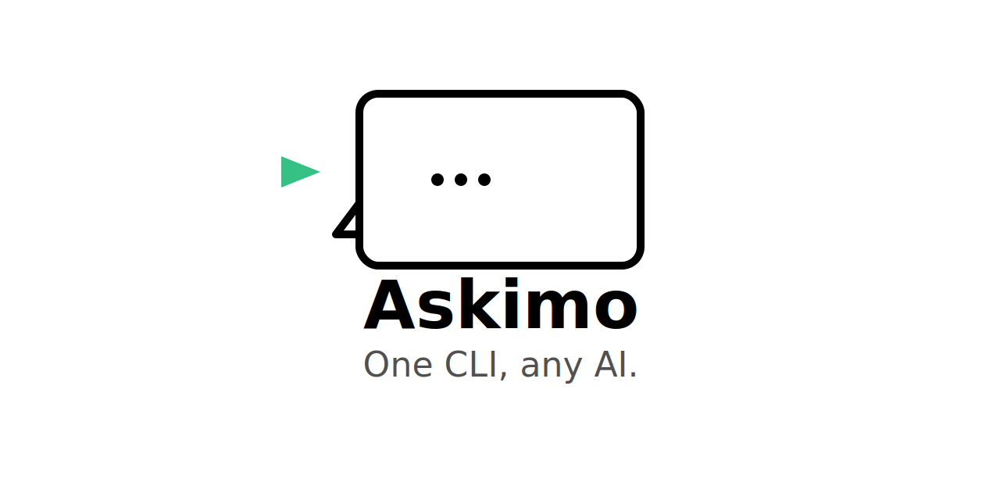
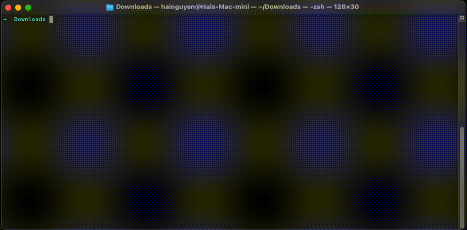
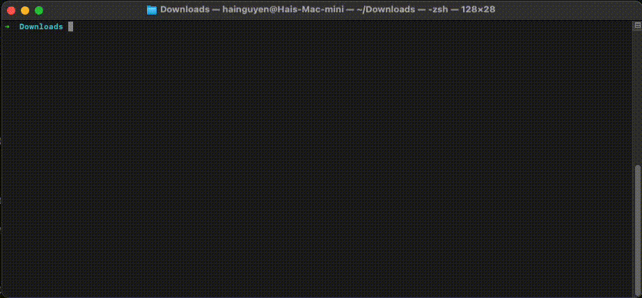
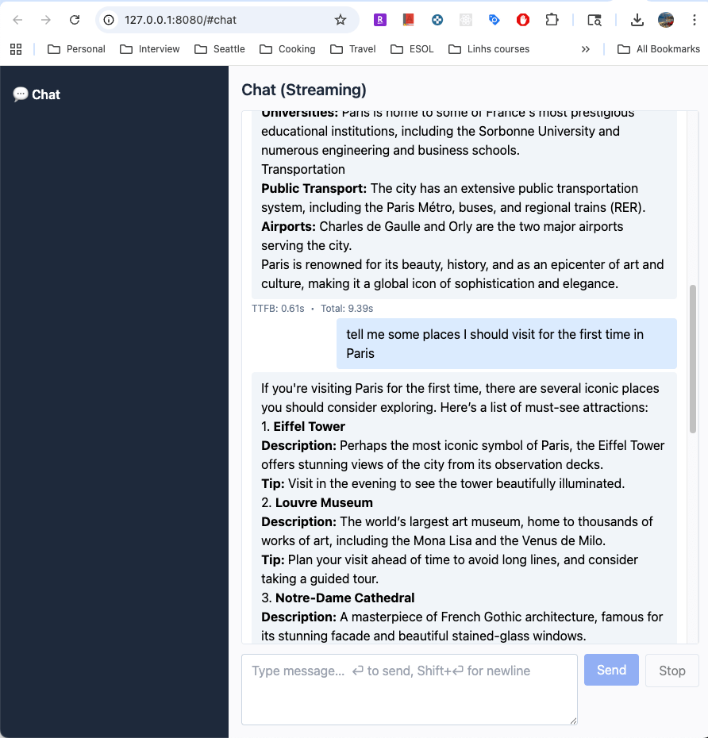

<picture>
  <source media="(prefers-color-scheme: dark)" srcset="public/askimo-logo-dark.svg">
  
</picture>

# Askimo
[](https://github.com/haiphucnguyen/askimo/actions/workflows/release.yml)
[](./LICENSE)
[](https://github.com/haiphucnguyen/askimo/releases)
[](./CONTRIBUTING.md#-enforcing-dco)


`Askimo` is a powerful, pluggable command-line chat assistant that lets you talk to AI models like OpenAI, Ollama, X AI, and more — right from your terminal. It’s built for convenience with session-based configuration that’s saved locally, and it’s easy to extend with a simple plugin-style system.

> Ask anything, switch models, and customize your AI experience — all from your terminal.

## Features

* Talk to many LLMs in one place — Use OpenAI, X AI, Ollama, and more without switching tools. The pluggable design makes it easy to add future providers as they appear.

* Switch models instantly – Change providers or models on the fly with a single command.

* Get answers in real time – Responses stream as they’re generated, so you don’t have to wait.

* Stay configured between sessions – Your models, providers, and API keys are saved locally and auto-loaded next time.

* Customize your experience – Tune temperature, top_p, max_tokens, and other parameters per provider.

* Pluggable architecture – Extend Askimo with your own [models](docs/creating-new-chat-model.md) and [commands](docs/creating-new-command.md).

* Work in a familiar REPL – Interactive terminal environment with built-in commands for setup, copying, and more.

* Command piping – Send output from other shell commands into Askimo (git log | askimo) and get AI-generated summaries or transformations.

* Portable and fast – Compiled as a native binary with GraalVM for instant startup.

* Runs anywhere – Fully cross-platform on macOS, Linux, and Windows.

* File system integration – Read and process local files directly from Askimo, turning their contents into AI prompts.

### Coming soon

* Custom prompt shortcuts – Define reusable commands like :release_notes <commits_file> to instantly generate release notes from a list of commits.

* Scripting mode – Run Askimo in non-interactive mode inside scripts or CI/CD pipelines.


## Demo

* Piping commands & switching providers in Askimo



* Interacting with the local file system in Askimo



💬 Simple Web Chat (Local Usage)

Askimo isn’t only for the terminal — you can also start a lightweight local web chat UI if you prefer a browser interface.
This feature is designed for quick testing or personal use, not for production deployment.

* **Start Askimo web server**
```
askimo --web
```


Then open your browser to the URL printed in the console (look for Web server running at http://127.0.0.1:8080). If port 8080 is busy, Askimo will pick the next free port—use the exact address shown in that log line.
The web UI supports real-time streaming responses and Markdown rendering.



> ⚠️ Important: Before running askimo web, you must finish setting up your AI provider (e.g., Ollama, OpenAI) and select a model using the Askimo CLI.
> The web version is currently a simple chat page — it does not support configuring providers, models, or AI parameters. All configuration must be done beforehand via the CLI.

## Installation

You can install Askimo in four ways today:

### 1. Homebrew (macOS/Linux)

If you’re on macOS or Linux, the easiest way is via [Homebrew](https://brew.sh/)
```bash
brew tap haiphucnguyen/askimo
brew install askimo
```
Once installed, you can run:
```bash
askimo
```
to start the CLI.

To update Askimo later:
```bash
brew upgrade askimo
```

### 2. Download Release Binaries

Prebuilt binaries for **macOS**, **Linux**, and **Windows** are available on the [Releases page](https://github.com/haiphucnguyen/askimo/releases).

1. Download the archive for your operating system.
2. Extract it.
3. Move the `askimo` (or `askimo.exe` on Windows) binary to a directory on your `$PATH`.

Example (Linux/macOS):

```bash
mv askimo /usr/local/bin/
```

### 3. Build from Source

If you prefer to build locally:
```
git clone git@github.com:haiphucnguyen/askimo.git
cd askimo
./gradlew nativeCompile
```

The binary will be located at `build/native/nativeCompile/askimo`

Run it directly:

```terminaloutput
./build/native/nativeCompile/askimo
```

### 4. Docker (macOS/Linux/Windows)
Run Askimo in a container while reading files from your host and persisting settings locally

**Quick start (REPL)**
```bash
IMAGE=ghcr.io/haiphucnguyen/askimo:latest   # or a specific tag like :v0.1.10
docker run --rm -it \
  -v "$HOME/.askimo:/home/nonroot/.askimo" \
  -v "$PWD:/home/nonroot/work" \
  -w /home/nonroot/work \
  $IMAGE
```

* `~/.askimo` on your machine is mounted to the container’s home so Askimo can store and reuse provider settings/keys locally (no -e OPENAI_API_KEY needed).

* Your current folder is mounted at `/home/nonroot/work`, so Askimo can read/write your project files.

**Pipe input**
```bash
cat logs.txt | docker run --rm -i \
  -v "$HOME/.askimo:/home/nonroot/.askimo" \
  -v "$PWD:/home/nonroot/work" -w /home/nonroot/work \
  ghcr.io/haiphucnguyen/askimo:latest "Summarize it"
```

## Available Commands

| Command        | Description                                    | Example Usage               |
|----------------|------------------------------------------------|-----------------------------|
| `:help`        | Show all available commands                    | `:help`                     |
| `:setparam`    | Set a parameter for the current provider       | `:setparam temperature 0.8` |
| `:params`      | View current session parameters                | `:params`                   |
| `:config`      | Edit Askimo configuration file                 | `:config`                   |
| `:providers`   | List all supported AI providers                | `:providers`                |
| `:setprovider` | Switch to a different AI provider              | `:setprovider ollama`       |
| `:models`      | List available models for the current provider | `:models`                   |
| `:copy`        | Copy the last response to the clipboard        | `:copy`                     |
| `:clear`       | Clear the chat history for the current session | `:clear`                    |
| `:exit`        | Exit the Askimo REPL                           | `:exit`                     |


➡ **[View the full command reference »](docs/commands.md)**  
Includes detailed usage, options, and examples for each command.


> 💡 Note: Some providers (such as OpenAI, X AI, etc.) require an API key.  
> Make sure you create and configure the appropriate key from your provider’s account dashboard before using them.

## Extending Askimo

Askimo is designed to be pluggable, so you can tailor it to your needs:

* Add a new chat model – Integrate any AI provider by following the guide in [docs/creating-new-chat-model.md](docs/creating-new-chat-model.md)

* Create a new command – Add custom CLI commands to automate tasks or build integrations. See [docs/creating-new-command.md](docs/creating-new-command.md).

## Contributing

* Fork & clone the repo

* Create a feature branch

* Open a PR

