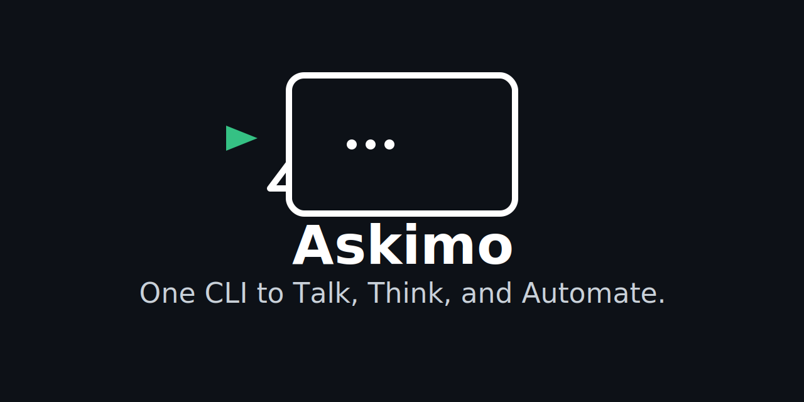

  <picture>
    <source media="(prefers-color-scheme: dark)" srcset="public/askimo-logo.svg">
    
  </picture>

  <b><a href="https://askimo.chat">askimo.chat</a></b> · AI for your workflows on desktop or in the terminal, with the freedom to choose any provider.

  
  
  
  
  

# Askimo

Askimo is a provider-agnostic AI toolkit that gives you two powerful interfaces:

- Askimo Desktop, a native multi-provider AI chat application
- Askimo CLI, a command-line tool for automation, DevOps, and workflows

Use OpenAI, Claude, Gemini, X AI, or local models like Ollama from one unified environment.

> Chat on desktop, script in the terminal, and use any AI provider you like.

## Askimo Products

### Askimo Desktop

A native application that brings all your AI conversations into one interface.  
Designed for writers, developers, researchers, and anyone who needs fast and consistent AI assistance.

#### Key Desktop Features
- Switch between OpenAI, Claude, Gemini, X AI, and Ollama instantly
- Persistent local chat history
- Markdown rendering, syntax highlighting, and image support
- Star and save important conversations
- Custom directives for shaping AI responses
- Smart search across your chat history
- Privacy by default, no cloud storage
- Prompt library and keyboard shortcuts

Get Askimo Desktop: https://askimo.chat/desktop

### Askimo CLI

A flexible AI automation tool built for terminal workflows, scripting, and development pipelines.

#### Key CLI Features
- Provider-agnostic commands
- Pipe logs, files, or command outputs directly into AI
- Reusable Recipes for automation
- Project workspaces with RAG indexing using PostgreSQL and pgvector
- Non-interactive mode for CI and automation
- Extensible provider and command architecture

Get Askimo CLI: https://askimo.chat/cli

## Why Askimo

Askimo is designed to adapt as the AI ecosystem evolves.  
It gives you control, flexibility, and workflow integration across both desktop and terminal environments.

Highlights:

- Freedom to use any provider without changing your workflow
- Unified interface for desktop chat and terminal automation
- RAG project workspaces for deep contextual understanding
- Reusable recipes for predictable automation
- Extensible platform for teams and custom integrations

## Demo

### Askimo Desktop Chat

### Askimo CLI Workflows

## Core Capabilities

Askimo brings together the power of AI models, the convenience of a native desktop experience, and the flexibility of a command line tool. Whether you are chatting, automating tasks, or working within a project, Askimo is built to fit the way you work.

### Unified AI Chat
Work with multiple AI providers in one place. Askimo keeps your entire conversation history available locally, with rich formatting, code highlighting, image support, provider switching, and fast full-text search. You can star important chats, organize your work, and export conversations when needed.

### Knowledge and Project Intelligence
Askimo CLI includes RAG-enabled project workspaces. It indexes your files, documentation, and code so AI responses include real project context. Backed by PostgreSQL and pgvector for reliable vector search.

### Automation and Terminal Workflows
Pipe logs, files, or command output directly into Askimo, or run prompts in non-interactive mode for CI pipelines. Recipes let you build reusable workflows for code review, documentation, summarization, and more.

### Flexible, Extensible Platform
Use any provider, add your own integrations, or extend Askimo with custom commands and models. Both Desktop and CLI follow a local-first approach for privacy and data control.

## Installation

Full installation guides for all platforms are available in the documentation.

- Askimo Desktop: https://askimo.chat/docs/desktop/installation

- Askimo CLI: https://askimo.chat/docs/cli/installation

## License

Apache 2.0. See [LICENSE](./LICENSE).
