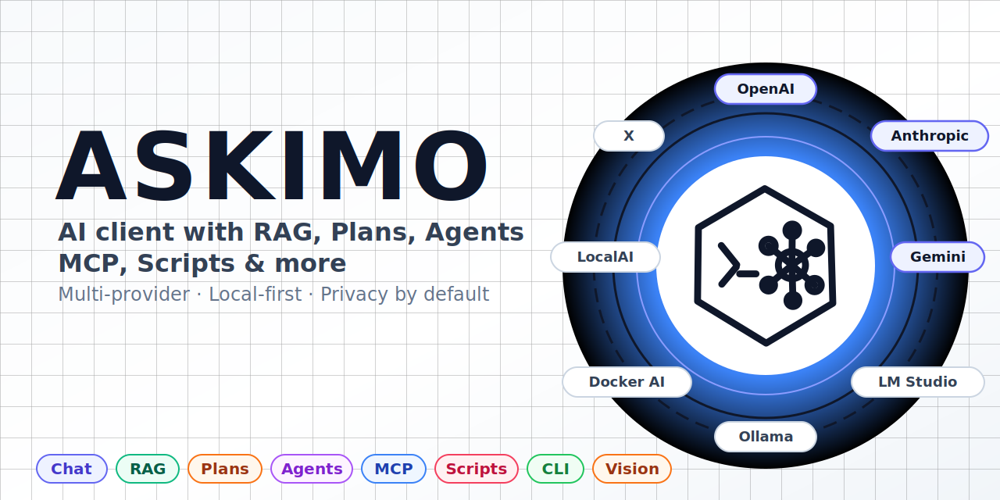
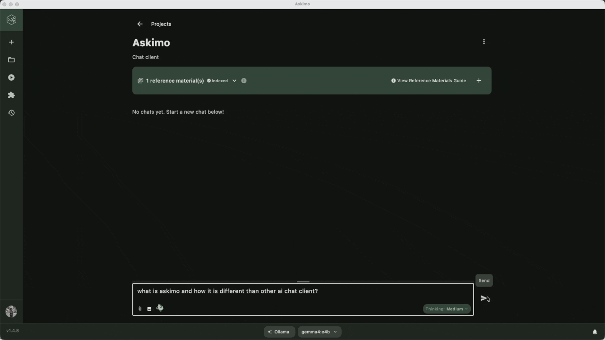
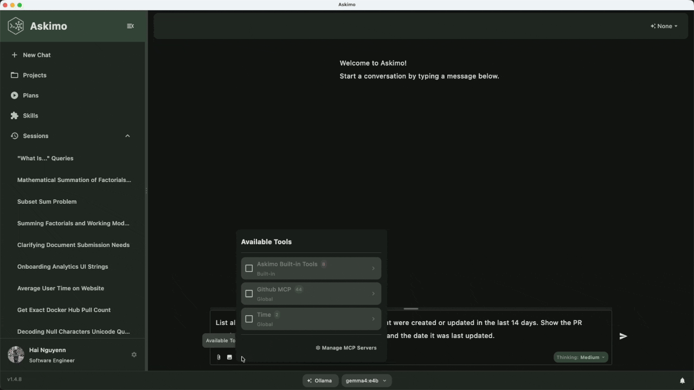
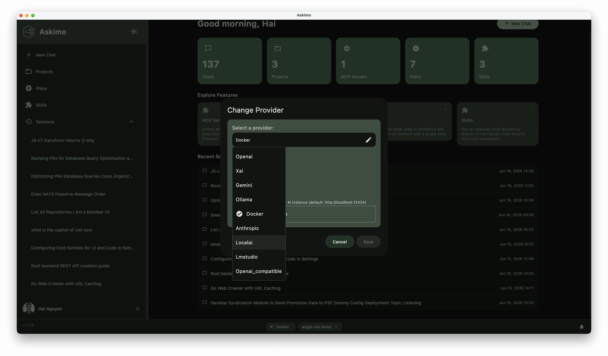
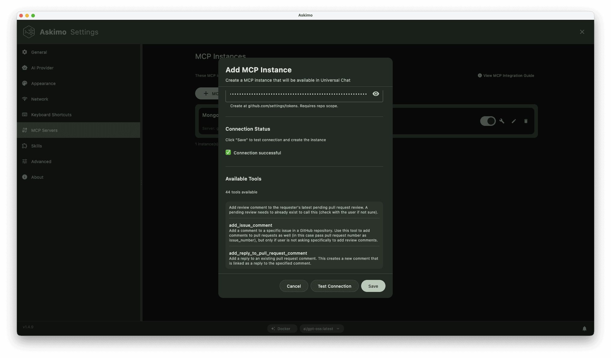
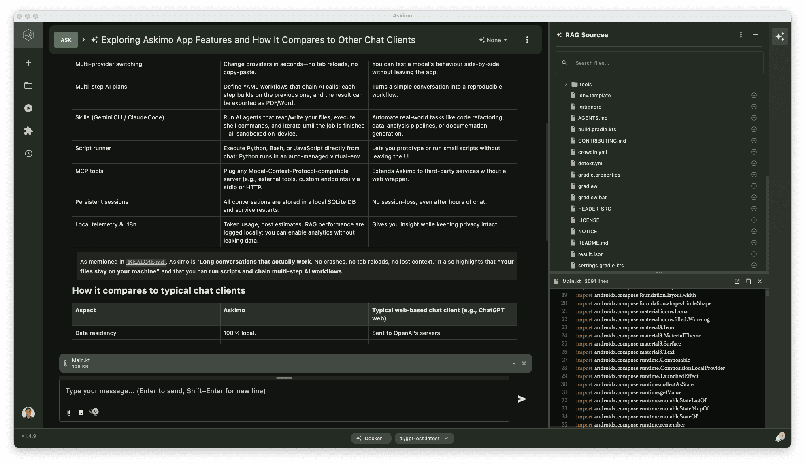

<p align="center">
  <picture>
    <source media="(prefers-color-scheme: dark)" srcset="public/github-logo-dark.svg">
    
  </picture>
</p>

<p align="center">
  <b>One app. Every AI model. Your files stay local.</b>
</p>

<p align="center">
  Chat · Search your files · Run scripts · Build multi-step AI workflows · Execute AI agent skills - all offline-capable, all on your machine.
</p>

<p align="center">
  <a href="https://github.com/askimo-ai/askimo/actions/workflows/cli-release.yml">
    
  </a>
  <a href="https://github.com/askimo-ai/askimo/actions/workflows/desktop-release.yml">
    
  </a>
  <a href="./LICENSE">
    
  </a>
  <a href="https://github.com/askimo-ai/askimo/releases">
    
  </a>
  <a href="./CONTRIBUTING.md#-enforcing-dco">
    
  </a>
</p>

<p align="center">
  <a href="https://github.com/askimo-ai/askimo/stargazers">
    
  </a>
  <a href="https://github.com/askimo-ai/askimo/releases">
    
  </a>
  
  
  
</p>

<p align="center">
  
  
  
  
  
  
  
  
</p>

<p align="center">
  
  
</p>

<p align="center">
  <a href="https://github.com/askimo-ai/askimo/releases/latest"><strong>📥 Download</strong></a> •
  <a href="https://askimo.chat/docs/"><strong>📖 Documentation</strong></a> •
  <a href="https://github.com/askimo-ai/askimo/discussions"><strong>💬 Discussions</strong></a> •
  <a href="https://github.com/askimo-ai/askimo/stargazers"><strong>⭐ Star on GitHub</strong></a>
</p>

---

## Why Askimo?

You shouldn't have to choose between the best AI model, your privacy, and getting real work done.

- **One app, every model.** Stop juggling browser tabs. Chat with OpenAI, Claude, Gemini, Grok, or a local Ollama model, switch in seconds, no copy-pasting.
- **Built as a native desktop app.** Not a web wrapper. Starts fast, runs lean, and stays responsive even after hours of use and thousands of messages in a single conversation.
- **Long conversations that actually work.** No crashes, no tab reloads, no lost context. Askimo handles deep, extended sessions the way a real desktop app should.
- **Your files stay on your machine.** Search and chat with your own documents using local RAG. Nothing is uploaded. Nothing leaves your device.
- **More than just chat.** Run Python/Bash scripts, chain multi-step AI workflows, and connect MCP tools, all from the same app.

---

## See It in Action

**Multi-step AI Plans** - fill in a form, get a finished deliverable:

[](public/askimo_plan_1920.gif)

**RAG** - search and chat with your local files:

[](public/askimo_rag_1920.gif)

**Script runner** - execute Python, Bash, and JavaScript from chat:

[](public/askimo_run_script_1920.gif)

**MCP tools** - connect any MCP-compatible server:

[](public/askimo_mcp_1920.gif)

<p align="center">
  
  
  
</p>

---

## Quick Start

**[Download for macOS, Windows, or Linux →](https://askimo.chat/download/)**

1. Install and open Askimo
2. Add a provider - paste an API key (OpenAI, Claude, Gemini…) or point it at a running Ollama instance
3. Start chatting

[Full setup guide →](https://askimo.chat/docs/desktop/ai-providers/)

### System Requirements

| | |
|---|---|
| **OS** | macOS 11+, Windows 10+, Linux (Ubuntu 20.04+, Debian 11+, Fedora 35+) |
| **Memory** | 50–300 MB (AI models require additional memory depending on provider) |
| **Disk** | 250 MB |

---

## Features

- **Multi-provider** - Switch between OpenAI, Claude, Gemini, Grok, Ollama, LM Studio, LocalAI, Docker AI, or any OpenAI-compatible endpoint per session
- **Local RAG** - Index local folders, files, and web URLs. Hybrid BM25 + vector retrieval with an AI classifier that skips retrieval when the query doesn't need it. Your data never leaves your machine.
- **Plans (agentic workflows)** - Chain multi-step AI pipelines from a form UI. Each step builds on the previous; progress shown live. Export as PDF or Word. Define your own plans in YAML or generate them by describing your workflow in plain English.
- **Skills** - Define reusable AI agents as Markdown files and execute them via [Gemini CLI](https://github.com/google-gemini/gemini-cli) or [Claude Code](https://docs.anthropic.com/en/docs/claude-code). Skills carry a system prompt, run in a sandboxed workspace, stream live activity, and persist a full run history.
- **Script runner** - Execute Python, Bash, and JavaScript from chat. Python runs in an auto-managed virtualenv with automatic dependency installation.
- **MCP tool integration** - Connect MCP-compatible servers via stdio or HTTP, scoped globally or per project
- **Persistent sessions** - Conversations stored in a local SQLite database, restored on restart
- **Vision** - Attach images to conversations; works with any multimodal model
- **CLI** - Native binary (GraalVM). Scriptable, automatable, headless-friendly.
- **Local telemetry** - Token usage, cost estimates, RAG performance per provider. Nothing uploaded.
- **i18n** - English, Chinese (Simplified & Traditional), Japanese, Korean, French, Spanish, German, Portuguese, Vietnamese

---

## Beyond Chat: Skills and Plans

Most AI apps stop at a chat box. Askimo goes further with two automation primitives that turn AI from a conversation tool into a work tool.

**Skills** delegate real work to an agent runtime ([Claude Code](https://docs.anthropic.com/en/docs/claude-code) or [Gemini CLI](https://github.com/google-gemini/gemini-cli)) running directly on your machine. The agent reads and writes your files, runs shell commands, and iterates until the job is done, without you copy-pasting anything. Point it at a codebase, describe the task, and the agent handles the rest. More runtimes are planned.

**Plans** break complex reasoning into a chain of focused AI steps, each building on the last. Instead of asking a single prompt to research, analyse, and write simultaneously, a Plan assigns each stage its own goal and persona. You fill in a form, click Run, and get a finished deliverable (a report, a cover letter, a blog post) ready to export as PDF or Word.

| | Skills | Plans |
|---|---|---|
| **Use when** | The task needs to touch files, run commands, or modify code | The task is pure reasoning: text in, polished output out |
| **Runs via** | Claude Code or Gemini CLI on your machine | Askimo's built-in AI, no extra installs |
| **Example** | "Refactor my API routes to follow REST conventions" | "Write a competitor analysis report for my product" |

[Skills documentation →](https://askimo.chat/docs/desktop/skills/) · [Plans documentation →](https://askimo.chat/docs/desktop/plans/)

---

## Supported Providers

**Cloud:** OpenAI · Anthropic Claude · Google Gemini · xAI Grok  
**Local:** Ollama · LM Studio · LocalAI · Docker AI  
**Custom:** Any OpenAI-compatible endpoint via custom base URL

---

## Building from Source

### Prerequisites

- JDK 21+
- Git

```bash
git clone https://github.com/askimo-ai/askimo.git
cd askimo

# Run the desktop app
./gradlew :desktop:run

# Build native installers
./gradlew :desktop:package

# Build CLI native binary (requires GraalVM)
./gradlew :cli:nativeCompile
```

### Project Structure

| Module | Description |
|---|---|
| `desktop/` | Compose Multiplatform desktop application |
| `desktop-shared/` | Shared UI components |
| `cli/` | JLine3 REPL + GraalVM native image |
| `shared/` | Core: providers, RAG, MCP, memory, tools, database, plans engine, skills & agent runtimes |

See [CONTRIBUTING.md](./CONTRIBUTING.md) for development guidelines and DCO requirements, or the [Development Getting Started Guide](https://askimo.chat/docs/development/getting-started/).

---

## Localization

English · 中文 (简体/繁體) · 日本語 · 한국어 · Français · Español · Deutsch · Português · Tiếng Việt

Translations are managed on Crowdin. Contributions welcome - no coding required.

[](https://crowdin.com/project/askimo)

[Help translate Askimo →](https://askimo.chat/docs/contributing/contributing-localization/)

---

## Getting Help

- [Documentation](https://askimo.chat/docs/)
- [GitHub Discussions](https://github.com/askimo-ai/askimo/discussions)
- [Issue Tracker](https://github.com/askimo-ai/askimo/issues)

---

## Contributing

Bug reports, feature requests, and pull requests are welcome. See [CONTRIBUTING.md](./CONTRIBUTING.md) for details.

---

## License

AGPLv3. See [LICENSE](./LICENSE).

---

## Star History

<a href="https://www.star-history.com/?repos=askimo-ai%2Faskimo&type=date&legend=top-left">
 <picture>
   <source media="(prefers-color-scheme: dark)" srcset="https://api.star-history.com/chart?repos=askimo-ai/askimo&type=date&theme=dark&legend=top-left" />
   <source media="(prefers-color-scheme: light)" srcset="https://api.star-history.com/chart?repos=askimo-ai/askimo&type=date&legend=top-left" />
   
 </picture>
</a>

